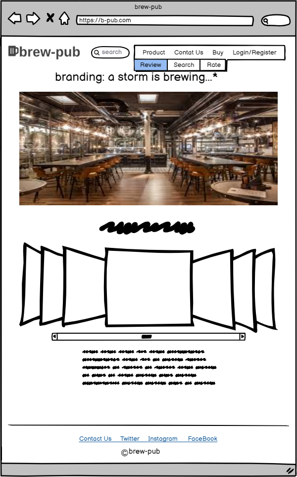
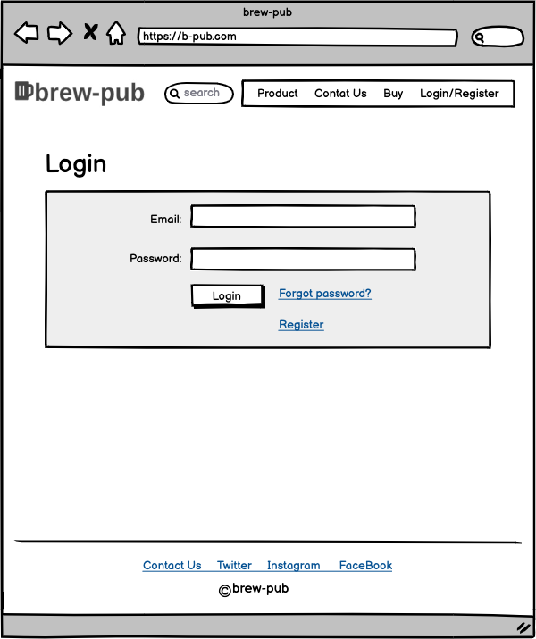
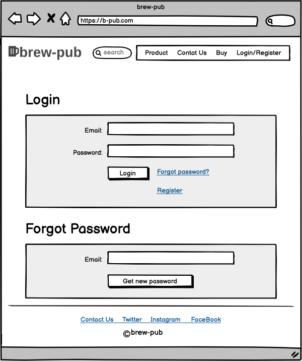
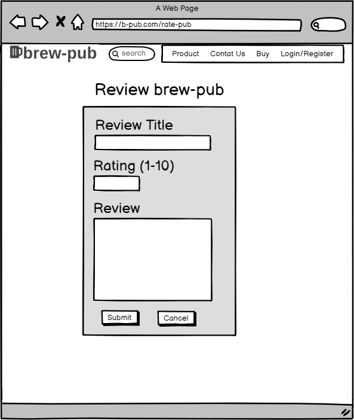
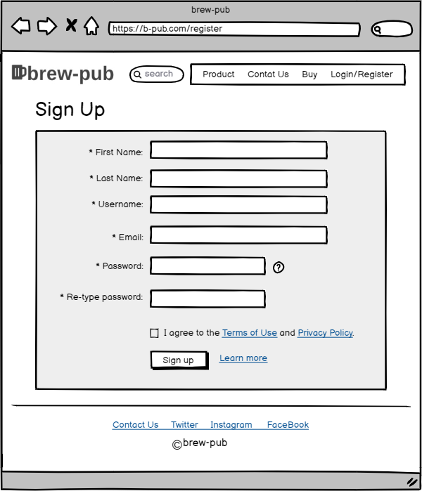
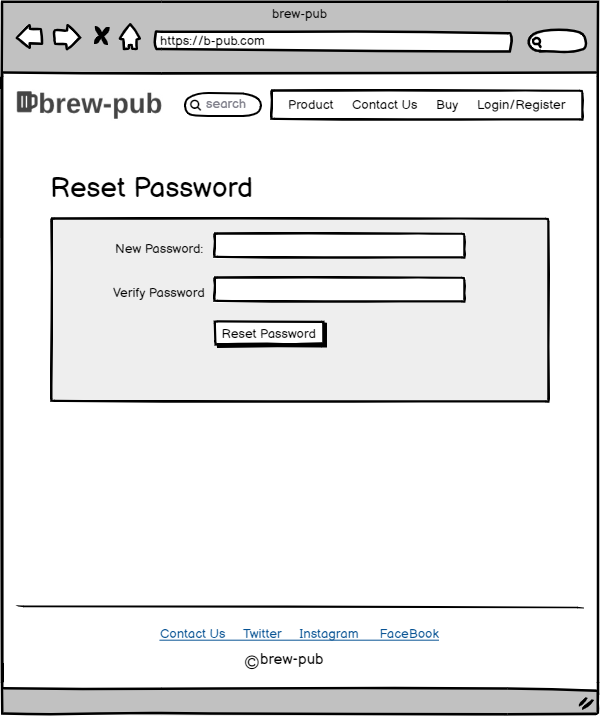
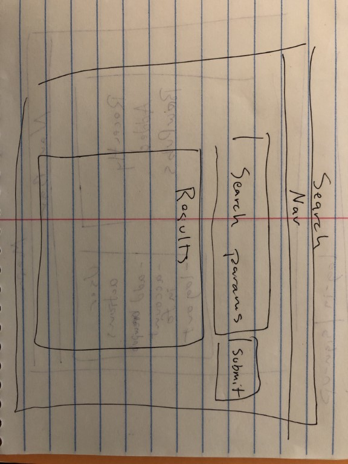
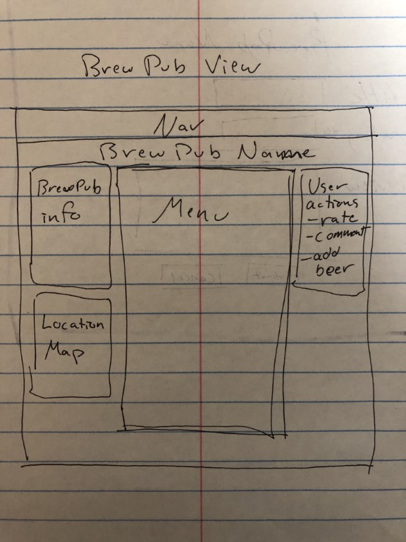
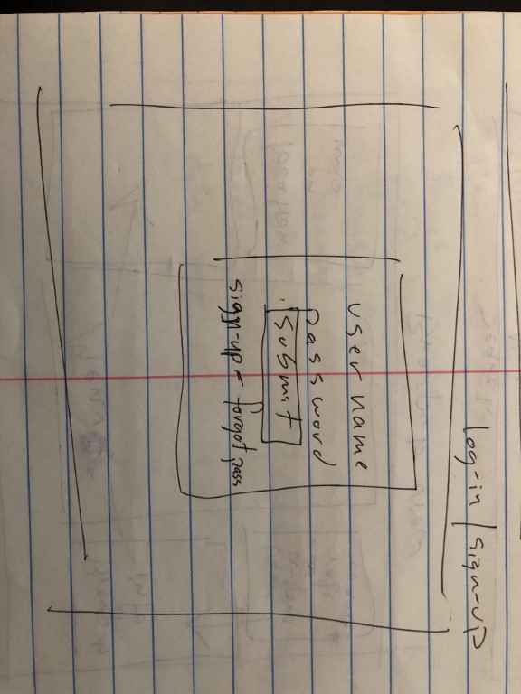
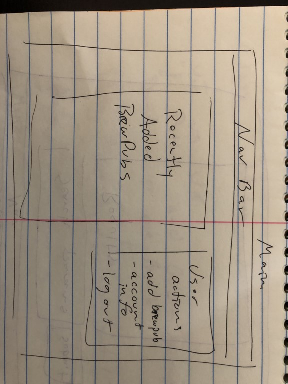

# Project Planning
For this assignment, you'll create some initial plans for your project.

## Assignment Description
[Project Planning Assignment](https://education.launchcode.org/liftoff/modules/assignments/project-planning)

## Submission Instructions

### Wireframes

* [Homepage wireframe](resources/brew-pub-wireframe-homepage.png)

 

* [Login wireframe](resources/brew-pub-wireframe-login.png)

* [Login/Forgot Password wireframe](resources/brew-pub-wireframe-login-forgot-pass.png)

* [Rate wireframe](resources/brew-pub-wireframe-rate.png)

* [Register wireframe](resources/brew-pub-wireframe-register.png)

* [Reset Password wireframe](resources/brew-pub-wireframe-reset-pass.png)

* [Search wireframe](resources/brew-pub-wireframe-search.jpeg)

* [Brewpub view wireframe](resources/brew-pub-wireframe-brewpub-view.jpeg)

* [Login alternate wireframe](resources/brew-pub-wireframe-login-alternate.jpeg)

* [Homepage alternate wireframe](resources/brew-pub-wireframe-homepage-alternate.jpeg)

### Project Tracker

https://trello.com/b/N9nEERW5/liftoff-2020

### Project Repo Link

https://github.com/LaunchCodeLiftoffProjects/brew-pub